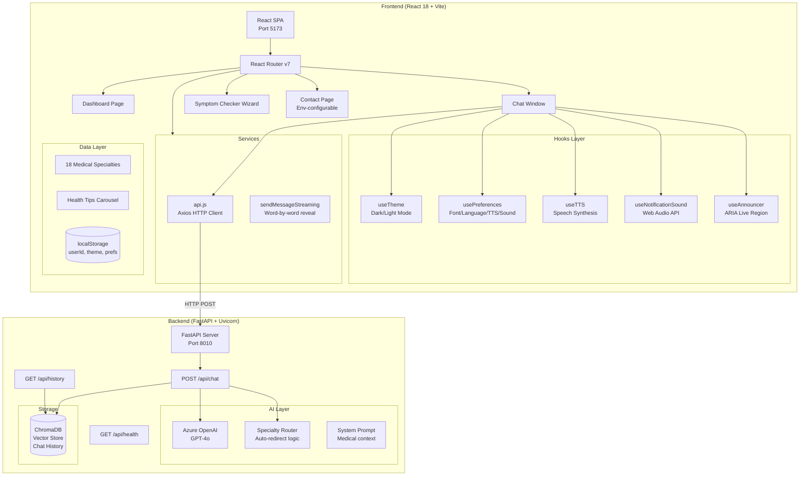
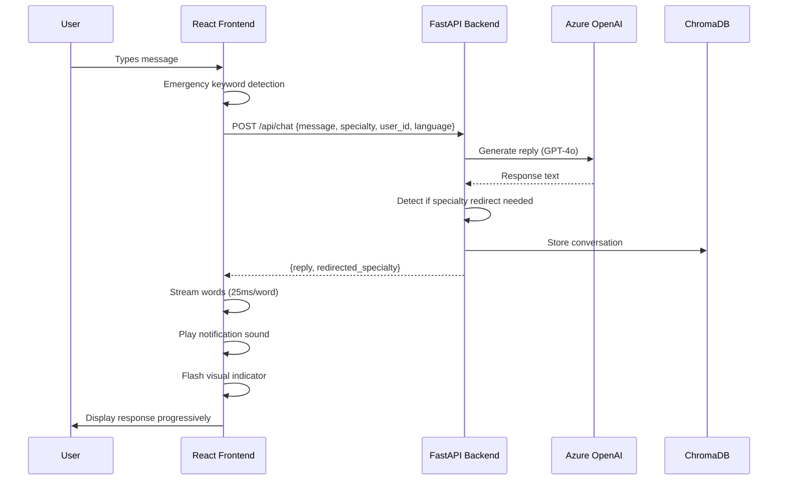

# Virtual Health Assistant — Technical Documentation

## Table of Contents

1. [Project Overview](#project-overview)
2. [Architecture Diagram](#architecture-diagram)
3. [Tech Stack](#tech-stack)
4. [Project Structure](#project-structure)
5. [Setup & Installation](#setup--installation)
6. [Feature Documentation](#feature-documentation)
7. [API Reference](#api-reference)
8. [Testing Guide](#testing-guide)
9. [Accessibility Compliance](#accessibility-compliance)
10. [Browser Compatibility](#browser-compatibility)

---

## Project Overview

The **Virtual Health Assistant** is a hospital-grade AI health portal that provides multi-specialty medical consultations via a chat interface powered by Azure OpenAI (GPT-4o). It features 18 medical departments, a symptom checker wizard, dedicated Services and Contact pages, an env-configurable doctors directory, full accessibility support (WCAG 2.1 AA), dark mode, voice input/output, multi-language support, and a responsive mobile-first design.

---

## Architecture Diagram



### Data Flow Diagram



---

## Tech Stack

| Layer | Technology | Version |
|-------|-----------|---------|
| Frontend Framework | React | 18.2 |
| Build Tool | Vite | 5.4.21 |
| Routing | react-router-dom | 7.15.1 |
| HTTP Client | Axios | 1.5.0 |
| Markdown Rendering | react-markdown | 10.1.0 |
| Icons | react-icons | 5.6.0 |
| Backend Framework | FastAPI | Latest |
| AI Model | Azure OpenAI GPT-4o | 2024-12-01-preview |
| Vector DB | ChromaDB | 1.5.5 |
| Typography | Google Fonts (Merriweather + Nunito Sans) | — |
| Speech | Web Speech API | Native |
| Audio | Web Audio API | Native |

---

## Project Structure

```
medical 1/
├── index.html                     # Entry HTML
├── package.json                   # Dependencies & scripts
├── vite.config.mjs                # Vite configuration
├── DOCUMENTATION.md               # This file
├── src/
│   ├── main.jsx                   # React DOM entry point
│   ├── App.jsx                    # Route definitions
│   ├── styles.css                 # Global styles (~2000+ lines)
│   ├── components/
│   │   ├── Dashboard.jsx          # Landing page / portal
│   │   ├── ChatWindow.jsx         # Main chat interface
│   │   ├── Message.jsx            # Individual message bubble
│   │   ├── TypingIndicator.jsx    # Animated typing dots
│   │   ├── SymptomChecker.jsx     # 4-step guided wizard
│   │   ├── Services.jsx           # Services page (all departments)
│   │   ├── Contact.jsx            # Contact page (env-configurable)
│   │   ├── AppSelector.jsx        # App/theme selector
│   │   └── ThemedDashboard.jsx    # Themed variant
│   ├── hooks/
│   │   ├── useTheme.js            # Theme, prefs, TTS, sound, emergency hooks
│   │   └── useAnnouncer.jsx       # ARIA live announcer
│   ├── services/
│   │   └── api.js                 # Backend API client + streaming
│   └── data/
│       ├── specialties.js         # 18 medical departments
│       ├── healthTips.js          # Rotating health tips
│       └── appThemes.js           # Theme configurations
├── backend/
│   └── app/
│       ├── main.py                # FastAPI application
│       ├── ai.py                  # Azure OpenAI integration
│       ├── history_store.py       # ChromaDB storage
│       └── specialty_router.py    # Specialty detection logic
└── dist/                          # Production build output
```

---

## Setup & Installation

### Prerequisites

- **Node.js** ≥ 18.x
- **Python** ≥ 3.10
- **npm** ≥ 9.x
- Azure OpenAI API access (GPT-4o deployment)

### Frontend Setup

```bash
# 1. Navigate to project directory
cd "medical 1"

# 2. Install dependencies
npm install

# 3. Create environment file (optional — defaults to localhost:8000)
echo "VITE_API_BASE_URL=http://localhost:8010" > .env

# 4. Start development server
npm run dev
# → Frontend available at http://localhost:5173

# 5. Production build
npm run build

# 6. Preview production build
npm run preview
```

### Backend Setup

```bash
# 1. Navigate to backend directory
cd backend

# 2. Create virtual environment
python -m venv venv
venv\Scripts\activate        # Windows
# source venv/bin/activate   # macOS/Linux

# 3. Install dependencies
pip install fastapi uvicorn openai chromadb python-dotenv

# 4. Set environment variables
set AZURE_OPENAI_ENDPOINT=https://your-endpoint.openai.azure.com/
set AZURE_OPENAI_KEY=your-api-key
set AZURE_OPENAI_API_VERSION=2024-12-01-preview

# 5. Start the backend server
uvicorn app.main:app --host 0.0.0.0 --port 8010 --reload
```

### Full Stack Quick Start

```bash
# Terminal 1 — Backend
cd backend && uvicorn app.main:app --port 8010 --reload

# Terminal 2 — Frontend
cd "medical 1" && npm run dev
```

---

## Feature Documentation

### Feature 1: Multi-Specialty Chat System

**Description:** 18 medical departments with dedicated AI personas, contextual prompts, and automatic specialty routing.

**Technical Details:**
- Each specialty defined in `src/data/specialties.js` with: `id`, `name`, `slug`, `icon`, `description`, `color`, `prompts[]`
- Route: `/chat/:specialty` — the URL slug maps to the specialty configuration
- Backend uses `specialty_router.py` to detect if a question belongs to a different department
- When redirect detected, a modal popup offers to switch departments

**Files:** `src/data/specialties.js`, `src/components/ChatWindow.jsx`, `backend/app/specialty_router.py`

**All 18 Specialties:**

| # | Specialty | Slug | Icon |
|---|-----------|------|------|
| 1 | General Surgery | `general-surgery` | FaProcedures |
| 2 | Dietitian / Nutrition | `dietitian` | FaAppleAlt |
| 3 | Dentist | `dentist` | FaTooth |
| 4 | Physiotherapy | `physiotherapy` | FaWalking |
| 5 | Neurosurgeon | `neurosurgeon` | FaBrain |
| 6 | Cardiologist | `cardiologist` | FaHeartbeat |
| 7 | Dermatologist | `dermatologist` | FaHandSparkles |
| 8 | Pediatrician | `pediatrician` | FaBaby |
| 9 | Psychiatrist | `psychiatrist` | MdPsychology |
| 10 | Orthopedics | `orthopedics` | FaBone |
| 11 | ENT Specialist | `ent` | MdHearing |
| 12 | Gynecologist | `gynecologist` | MdPregnantWoman |
| 13 | Ophthalmologist | `ophthalmologist` | FaEye |
| 14 | Pulmonologist | `pulmonologist` | FaLungs |
| 15 | Urologist | `urologist` | GiKidneys |
| 16 | Gastroenterologist | `gastroenterologist` | GiStomach |
| 17 | Endocrinologist | `endocrinologist` | GiHypodermicTest |
| 18 | General Physician | `general-physician` | FaStethoscope |

---

### Feature 2: Dark Mode / Theme Toggle

**Description:** System-aware dark mode with manual toggle. Persists across sessions via localStorage.

**Technical Details:**
- Hook: `useTheme()` in `src/hooks/useTheme.js`
- Sets `data-theme="dark|light"` attribute on `<html>`
- Respects `prefers-color-scheme` media query on first visit
- Stored in localStorage key: `medicare-theme`
- All CSS uses `[data-theme="dark"]` selectors for dark variants

**State Flow:**
```
localStorage → initial state → useEffect → document attribute → CSS selectors
```

**Testing:**
1. Click moon/sun icon in chat header
2. Verify colors switch immediately
3. Refresh page — theme should persist
4. Delete localStorage key — should fall back to OS preference

---

### Feature 3: Voice Input (Speech Recognition)

**Description:** Hands-free message input using Web Speech API speech recognition.

**Technical Details:**
- Uses `webkitSpeechRecognition` / `SpeechRecognition` API
- Continuous recognition with `interimResults: true`
- Visual feedback: red recording indicator + microphone icon toggle
- Gracefully degrades on unsupported browsers (button hidden)
- Located in `ChatWindow.jsx` as `toggleVoice()` function

**Testing:**
1. Click microphone button in input area
2. Speak a medical question
3. Verify text appears in input field
4. Click again to stop — message should auto-send or wait for Enter

---

### Feature 4: Text-to-Speech (TTS) Output

**Description:** AI responses can be read aloud using browser speech synthesis. Per-message speaker button.

**Technical Details:**
- Hook: `useTTS(enabled)` in `src/hooks/useTheme.js`
- Uses `SpeechSynthesisUtterance` with `rate: 0.95`, `pitch: 1`
- Strips markdown formatting before speaking (regex: removes #, *, _, `, links)
- Toggle in preferences panel enables/disables globally
- Each bot message shows FaVolumeUp/FaVolumeMute button

**Components:** `src/components/Message.jsx` (speaker button), `src/hooks/useTheme.js` (hook)

**Testing:**
1. Open preferences panel (gear icon)
2. Toggle "TTS" to ON
3. Send a message and wait for response
4. Click speaker icon on bot message — should read aloud
5. Click again to stop mid-speech

---

### Feature 5: Font Size Adjuster

**Description:** Four font size levels (Small/Medium/Large/Extra Large) adjustable from header button or preferences panel.

**Technical Details:**
- CSS variable: `--app-font-size` applied to `<body>`
- Size map: `{ small: "14px", medium: "16px", large: "18px", xlarge: "22px" }`
- Header button cycles through sizes (FaFont icon)
- Preferences panel has dropdown selector
- Persisted in localStorage via `usePreferences()` hook

**Testing:**
1. Click "Aa" (FaFont) button in chat header — font cycles through sizes
2. Open prefs panel — verify dropdown matches current size
3. Select "Extra Large" — all text should grow to 22px
4. Refresh page — size persists

---

### Feature 6: Emergency Detection System

**Description:** Real-time detection of emergency keywords in user input. Shows red banner with emergency call button.

**Technical Details:**
- Function: `detectEmergency(text)` in `src/hooks/useTheme.js`
- Keywords: "chest pain", "heart attack", "can't breathe", "stroke", "seizure", "unconscious", "severe bleeding", "choking", "anaphylaxis", "overdose", "suicide", "loss of consciousness", "paralysis", "not breathing"
- Triggered on every `onChange` of the input field
- Banner includes: warning icon, message text, and "Call 911" anchor link
- CSS: pulsing red animation (`emergencyPulse`) + icon shake

**Testing:**
1. Type "I'm having chest pain" in the input
2. Red emergency banner should appear immediately
3. Verify "Call 911" button links to `tel:911`
4. Clear input or send message — banner disappears

---

### Feature 7: Session Management

**Description:** Start fresh chat sessions without losing previous data. New session generates a fresh user ID.

**Technical Details:**
- `startNewSession()` function in `ChatWindow.jsx`
- Generates new UUID via `crypto.randomUUID()`
- Stores in localStorage (key: `medical-user-id`)
- Clears current message array
- FaPlus button in header triggers it

**Testing:**
1. Have a conversation with a few messages
2. Click "+" button in header
3. Messages should clear, new session starts
4. Previous session's history is preserved in ChromaDB (accessible via history API)

---

### Feature 8: Symptom Checker Wizard

**Description:** 4-step guided flow that routes users to the correct medical specialty based on symptoms.

**Technical Details:**
- Component: `src/components/SymptomChecker.jsx`
- Route: `/symptom-checker`
- Steps: Body Area (10 options) → Duration (5 options) → Severity (4 levels) → Recommendation
- Maps body areas to specialty slugs (e.g., "Chest & Heart" → cardiologist)
- Emergency severity shows "Call 911" instead of specialist recommendation
- Progress bar with numbered steps
- ARIA: `role="radiogroup"`, `role="progressbar"`

**Body Area Mapping:**
| Area | Specialties |
|------|------------|
| Head & Neck | Neurologist, ENT |
| Chest & Heart | Cardiologist |
| Stomach & Digestive | Gastroenterologist |
| Bones & Joints | Orthopedic |
| Skin & Hair | Dermatologist |
| Mind & Emotions | Psychiatrist |
| Teeth & Mouth | Dentist |
| Pregnancy | Obstetrician |
| Child Health | Pediatrician |
| General | General Physician |

**Testing:**
1. Navigate to `/symptom-checker` (or click "Check Symptoms" on dashboard)
2. Select "Chest & Heart" → "A few days" → "Moderate"
3. Verify it recommends Cardiologist with "Start Consultation" button
4. Click button — navigates to `/chat/cardiologist`
5. Test emergency path: select severity "Emergency" → verify 911 prompt appears

---

### Feature 9: Response Streaming (Progressive Word Reveal)

**Description:** AI responses appear word-by-word (simulated streaming) for a natural typing effect.

**Technical Details:**
- Function: `sendMessageStreaming()` in `src/services/api.js`
- Makes full API call, then reveals response words at 25ms intervals
- Updates message state progressively using React state updater pattern
- Typing indicator disappears after first word chunk arrives
- Callback pattern: `onChunk(partialText)` called for each word addition

**Implementation:**
```javascript
const words = data.reply.split(" ");
for (let i = 0; i < words.length; i++) {
  partial += (i > 0 ? " " : "") + words[i];
  onChunk(partial);
  await new Promise((r) => setTimeout(r, 25));
}
```

**Testing:**
1. Send any message in chat
2. Observe response appearing word-by-word instead of all at once
3. Verify typing indicator disappears once first word renders
4. Long responses (~100+ words) should take ~2.5 seconds to fully appear

---

### Feature 10: Multi-Language Support

**Description:** 7 languages supported — AI responds in the selected language.

**Technical Details:**
- Languages: English, Hindi, Spanish, French, German, Chinese, Arabic
- Configured in `LANGUAGES` array (`src/hooks/useTheme.js`)
- Language preference stored in localStorage, passed as `language` parameter to backend API
- Backend should include language in system prompt for GPT-4o
- Selector in preferences panel with `<select>` dropdown

**API Integration:**
```javascript
POST /api/chat
{
  "message": "What causes headaches?",
  "specialty": "neurologist",
  "user_id": "user-abc123",
  "language": "hi"  // Hindi
}
```

**Testing:**
1. Open preferences (gear icon)
2. Change language to "Hindi"
3. Send a message — response should be in Hindi
4. Switch to "Spanish" — next response in Spanish
5. Preference persists across page refreshes

---

### Feature 11: Mobile Bottom Navigation

**Description:** Fixed bottom navigation bar for mobile screens (≤900px) with Chat, Settings, New, and Export actions.

**Technical Details:**
- Renders as `<nav className="mobile-bottom-nav">` in `ChatWindow.jsx`
- CSS: `display: none` by default, `display: flex` at `@media (max-width: 900px)`
- Buttons: Chat (focus input), Settings (toggle prefs), New (fresh session), Export (download chat)
- Position: fixed bottom, with box-shadow, z-index: 50
- Dark mode compatible with separate color scheme

**Testing:**
1. Resize browser to ≤900px width (or use mobile DevTools)
2. Bottom nav should appear with 4 icons
3. Tap "Settings" — prefs panel opens
4. Tap "New" — session resets
5. Tap "Export" — chat downloads as .txt file
6. On desktop (>900px) — nav should be hidden

---

### Feature 12: Notification Sound + Visual Flash

**Description:** Audio notification when AI responds (680Hz tone) + blue border flash for deaf/hard-of-hearing users.

**Technical Details:**
- Hook: `useNotificationSound(enabled)` in `src/hooks/useTheme.js`
- Uses Web Audio API: `OscillatorNode` at 680Hz, sine wave, 0.3s duration
- Gain ramps from 0.3 to 0.01 (fade out)
- Visual: `.chat-window.flash` class triggers `responseFlash` keyframe animation
- Flash: blue box-shadow pulse lasting 0.6 seconds
- Toggle in preferences panel (enabled by default)

**Audio Implementation:**
```javascript
const ctx = new AudioContext();
const osc = ctx.createOscillator();
osc.frequency.value = 680;
osc.type = "sine";
gain.gain.exponentialRampToValueAtTime(0.01, ctx.currentTime + 0.3);
```

**Testing:**
1. Ensure sound is ON in preferences (default)
2. Send a message — hear a soft "ding" when response arrives
3. Observe blue flash around chat window simultaneously
4. Toggle sound OFF in prefs — no ding, but flash still occurs
5. Test with screen reader — ARIA announcement still fires independently

---

### Feature 13: Chat Export

**Description:** Download entire chat conversation as a formatted .txt file.

**Technical Details:**
- Function: `exportChat()` in `ChatWindow.jsx`
- Format: `[timestamp] SENDER: message text` per line
- Uses `Blob` API + dynamic `<a>` element with `download` attribute
- Filename: `chat-{specialty}-{date}.txt`
- Accessible via download icon in header or mobile nav

**Testing:**
1. Have a conversation with multiple messages
2. Click download icon (FaDownload) in chat header
3. Verify .txt file downloads with correct format
4. Open file — timestamps and messages should be readable

---

### Feature 14: Health Tips Carousel

**Description:** Rotating health tips on the dashboard, cycling every 5 seconds.

**Technical Details:**
- Data: `src/data/healthTips.js` — 8 tips with `text` and `category`
- Auto-rotation via `setInterval` (5000ms) in Dashboard `useEffect`
- CSS animation: `tipFade` keyframe for smooth transitions
- Shows lightbulb icon + tip text + category badge

**Testing:**
1. Visit dashboard (`/`)
2. Observe health tip text
3. Wait 5 seconds — tip should change with fade animation
4. Verify all 8 tips cycle through

---

### Feature 15: Dark Mode (Full System)

**Description:** Complete dark theme affecting all components — dashboard, chat, modals, inputs, and overlays.

**Technical Details:**
- Attribute: `[data-theme="dark"]` on `<html>` element
- Color palette: Deep blues (#0d1b22, #112a35, #163545) with cyan accents
- All form elements, cards, borders, and backgrounds have dark variants
- Supports: system preference detection on first visit

---

### Feature 16: User Preferences Panel

**Description:** Collapsible settings panel in chat with TTS, sound, font size, and language controls.

**Technical Details:**
- State: `showPrefs` boolean toggled by gear icon (FaCog)
- Sections: TTS toggle, Sound toggle, Font size select, Language select
- Animated entry with `slideDown` keyframe
- All preferences persisted to localStorage (key: `medicare-preferences`)
- Default values: `{ fontSize: "medium", ttsEnabled: false, soundEnabled: true, language: "en", userName: "" }`

**Testing:**
1. Click gear icon in chat header
2. Panel slides down with 4 settings
3. Toggle each setting — verify immediate effect
4. Close panel (click gear again)
5. Refresh — all settings persist

---

### Feature 17: Print-Friendly Chat

**Description:** Clean print layout that hides navigation, inputs, and chrome — shows only message content.

**Technical Details:**
- CSS `@media print` block hides: nav, footer, header actions, sidebar, input area, voice button, mobile nav, prefs panel, TTS buttons
- Messages render at full width with simple borders
- Avatars hidden in print
- Page breaks avoided mid-message (`break-inside: avoid`)
- Page margins: 1.5cm

**Testing:**
1. Have a conversation with multiple messages
2. Press Ctrl+P (or File → Print)
3. Print preview should show clean message list
4. No navigation elements, buttons, or decorative UI visible
5. Messages should not break across pages

---

### Feature 18: ARIA Accessibility (Screen Reader Support)

**Description:** Full WCAG 2.1 AA compliance with ARIA live regions, semantic roles, and keyboard navigation.

**Technical Details:**
- Hook: `useAnnouncer()` in `src/hooks/useAnnouncer.jsx`
- Renders invisible `<div aria-live="polite" role="status">` 
- Announces: message sent, response received, errors, redirects
- Priority levels: "polite" (normal), "assertive" (emergencies)
- All interactive elements have `aria-label` attributes
- Focus management: popup traps focus, returns on close
- Skip links and `role="application"` on wizard

**Testing:**
1. Enable screen reader (NVDA/VoiceOver/Narrator)
2. Navigate to chat — hear page context announced
3. Send message — hear "Sending message. AI is thinking..."
4. When response arrives — hear "AI doctor has responded"
5. Tab through buttons — each announces its label
6. Open redirect popup — focus trapped inside modal

---

### Feature 19: Page Transitions

**Description:** Smooth animated transitions between routes (Dashboard → Chat → Symptom Checker).

**Technical Details:**
- `App.jsx` wraps routes in `<div className="page-transition" key={location.pathname}>`
- CSS animation: `pageIn` keyframe (opacity + translateY)
- `key` prop forces React to remount on route change, triggering animation
- Respects `prefers-reduced-motion` media query (disables animations)

**Testing:**
1. Navigate from Dashboard to any chat
2. Observe smooth fade-in/slide-up transition
3. Navigate back — same animation plays
4. Enable "Reduce motion" in OS settings — transitions should be instant

---

### Feature 20: Recent Conversations (Dashboard)

**Description:** Dashboard shows recent chat sessions for quick resumption.

**Technical Details:**
- Calls `getChatHistory()` on Dashboard mount
- Displays last few conversations grouped by specialty
- Each card links to `/chat/{specialty}` for continuation
- Shows message preview and timestamp

---

### Feature 21: Services Page

**Description:** Dedicated page listing all 18 medical specialties with feature highlights and direct links to start consultations.

**Technical Details:**
- Component: `src/components/Services.jsx`
- Route: `/services`
- Sections: Key Features grid (4 cards) + All Departments grid (18 specialty cards)
- Each department card links to `/chat/{slug}` with icon, name, description, and checkmark
- Full dark mode support with dedicated CSS selectors
- Responsive grid: `repeat(auto-fill, minmax(320px, 1fr))`

**Key Features Highlighted:**
1. AI-Powered Consultations
2. 24/7 Availability
3. Privacy First
4. Multi-Specialty Coverage

**Testing:**
1. Click "Services" in navigation bar
2. Verify 4 feature cards render with icons
3. Verify all 18 departments listed with correct icons/colors
4. Click any department → navigates to chat
5. Toggle dark mode → all cards readable

---

### Feature 22: Contact Page (Env-Configurable)

**Description:** Contact information page with hospital details, working hours, emergency info, map embed, and a directory of doctors — all configurable via `.env` variables.

**Technical Details:**
- Component: `src/components/Contact.jsx`
- Route: `/contact`
- All content reads from `import.meta.env.VITE_*` variables at build time
- Doctor list parsed from `VITE_DOCTORS` JSON array
- Supports 5-10 doctors (configurable by editing `.env`)
- Doctor cards show: avatar initials, name, specialty, qualification, experience, available days
- Includes: Address card, Phone card, Email card, Working Hours card, Emergency card, Map embed

**Environment Variables Used:**
| Variable | Renders As |
|----------|-----------|
| `VITE_HOSPITAL_NAME` | Page title header |
| `VITE_CONTACT_ADDRESS` | Address card |
| `VITE_CONTACT_PHONE` | Phone card (comma-split for multiple) |
| `VITE_CONTACT_EMAIL` | Email card (comma-split for multiple) |
| `VITE_CONTACT_HOURS` | Hours card (pipe-split for multiple lines) |
| `VITE_EMERGENCY_NUMBER` | Emergency card + tel: link |
| `VITE_CONTACT_MAP_URL` | Embedded Google Maps iframe |
| `VITE_DOCTORS` | Doctor directory grid |

**Testing:**
1. Click "Contact" in navigation bar
2. Verify hospital name, address, phones, emails, hours all display
3. Verify doctor cards show with initials avatar, name, specialty
4. Edit `.env` → change `VITE_HOSPITAL_NAME` → restart dev server → verify update
5. Add/remove doctors from `VITE_DOCTORS` → restart → verify grid updates
6. Toggle dark mode → all contact cards and doctor cards are readable

---

### Feature 23: Doctors Directory

**Description:** Configurable list of 5-10 real doctors displayed on the Contact page, editable anytime via the `.env` file.

**Technical Details:**
- Data source: `VITE_DOCTORS` environment variable (JSON array)
- Parsed with `JSON.parse()` with try/catch fallback to empty array
- Each doctor rendered as a card with gradient avatar (initials), name, specialty badge, qualifications, experience, and availability
- Grid layout: `repeat(auto-fill, minmax(320px, 1fr))`
- Dark mode: separate color scheme for cards, badges, and text

**Default Doctors (10):**

| # | Name | Specialty | Qualification | Experience |
|---|------|-----------|---------------|------------|
| 1 | Dr. Sarah Johnson | Cardiologist | MD, FACC | 15 years |
| 2 | Dr. Michael Chen | Neurologist | MD, PhD | 12 years |
| 3 | Dr. Priya Sharma | Dermatologist | MD, DDVL | 10 years |
| 4 | Dr. James Wilson | Orthopedics | MS Ortho, FRCS | 18 years |
| 5 | Dr. Emily Rodriguez | Pediatrician | MD, DCH | 8 years |
| 6 | Dr. David Kim | Psychiatrist | MD, MRCPsych | 14 years |
| 7 | Dr. Fatima Al-Hassan | Gynecologist | MBBS, MS OBG | 11 years |
| 8 | Dr. Robert Taylor | General Surgeon | MS, FRCS | 20 years |
| 9 | Dr. Ananya Patel | Endocrinologist | MD, DM Endo | 9 years |
| 10 | Dr. William Brown | Pulmonologist | MD, DTCD | 13 years |

**How to Edit:**
```bash
# Open .env and modify the VITE_DOCTORS JSON array
# Restart dev server after changes (Vite reads .env at startup)
npm run dev
```

---

## API Reference

### POST `/api/chat`

Send a message to the AI doctor.

**Request:**
```json
{
  "message": "What causes headaches?",
  "specialty": "neurologist",
  "user_id": "user-abc-123",
  "language": "en"
}
```

**Response:**
```json
{
  "reply": "Headaches can be caused by...",
  "redirected_specialty": null
}
```

**Redirect Response:**
```json
{
  "reply": "Based on your symptoms, this seems cardiac-related...",
  "redirected_specialty": "cardiologist"
}
```

### GET `/api/history`

Retrieve chat history for a user/specialty.

**Query Params:** `specialty`, `user_id`, `limit` (default 50)

**Response:**
```json
{
  "messages": [
    { "sender": "user", "text": "...", "timestamp": "..." },
    { "sender": "bot", "text": "...", "timestamp": "..." }
  ]
}
```

### GET `/api/health`

Health check endpoint.

**Response:** `{ "status": "ok" }`

---

## Testing Guide

### Manual Testing Checklist

| # | Feature | Steps | Expected Result |
|---|---------|-------|-----------------|
| 1 | Chat basic | Send "Hello" in any specialty | AI responds with relevant greeting |
| 2 | Specialty routing | Ask dental question in cardiology | Redirect popup appears |
| 3 | Dark mode | Click moon icon | All colors invert to dark palette |
| 4 | Voice input | Click mic → speak | Text appears in input field |
| 5 | TTS | Enable TTS → send msg → click speaker | Response read aloud |
| 6 | Font size | Click Aa button 3 times | Text grows: 16→18→22→14px |
| 7 | Emergency | Type "chest pain" | Red banner with 911 link |
| 8 | New session | Click + button | Chat clears, fresh session |
| 9 | Symptom checker | Complete all 3 steps | Correct specialty recommended |
| 10 | Streaming | Send any message | Words appear one-by-one |
| 11 | Language | Set Hindi → send msg | Response in Hindi |
| 12 | Mobile nav | Resize to <900px | Bottom nav appears |
| 13 | Sound | Send message (sound ON) | Hear 680Hz tone |
| 14 | Flash | Send message | Blue border pulse on chat |
| 15 | Export | Click download icon | .txt file downloads |
| 16 | Print | Ctrl+P | Clean message-only layout |
| 17 | Prefs persist | Change settings → refresh | Settings retained |
| 18 | Accessibility | Use Tab key | All elements focusable |
| 19 | Tips carousel | Wait on dashboard | Tips rotate every 5s |
| 20 | Transitions | Navigate between pages | Smooth fade animation |
| 21 | Services page | Click "Services" in nav | All 18 departments listed |
| 22 | Contact page | Click "Contact" in nav | Hospital info + doctors displayed |
| 23 | Doctor directory | View Contact page | 10 doctor cards with details |
| 24 | Nav links | Click Services/Contact in nav | Pages load correctly |
| 25 | Env config | Edit .env VITE_HOSPITAL_NAME → restart | Name updates on Contact page |

### Automated Testing Setup

```bash
# Install testing dependencies
npm install --save-dev vitest @testing-library/react @testing-library/jest-dom jsdom

# Add to package.json scripts:
# "test": "vitest",
# "test:run": "vitest run"
```

**Example test file** (`src/__tests__/emergency.test.js`):
```javascript
import { detectEmergency, EMERGENCY_KEYWORDS } from "../hooks/useTheme";

describe("Emergency Detection", () => {
  test("detects chest pain", () => {
    expect(detectEmergency("I have chest pain")).toBe(true);
  });

  test("ignores normal text", () => {
    expect(detectEmergency("I have a headache")).toBe(false);
  });

  test("case insensitive", () => {
    expect(detectEmergency("HEART ATTACK symptoms")).toBe(true);
  });

  test("all keywords detected", () => {
    EMERGENCY_KEYWORDS.forEach((kw) => {
      expect(detectEmergency(`I am experiencing ${kw}`)).toBe(true);
    });
  });
});
```

### Performance Testing

```bash
# Build and analyze bundle size
npm run build
# Expected output: ~393KB JS (130KB gzipped), ~85KB CSS (16KB gzipped)

# Lighthouse audit (in Chrome DevTools)
# Target scores: Performance >90, Accessibility >95, Best Practices >90
```

### Cross-Device Testing

| Device | Viewport | Key Checks |
|--------|----------|------------|
| Desktop | 1920x1080 | Full sidebar visible, all features |
| Tablet | 768x1024 | Sidebar collapses, cards reflow |
| Mobile | 375x667 | Bottom nav visible, sidebar hidden |
| Mobile (landscape) | 667x375 | Compact layout, scrollable |

---

## Accessibility Compliance

### WCAG 2.1 AA Conformance

| Criterion | Implementation |
|-----------|---------------|
| 1.1.1 Non-text Content | All icons have `aria-hidden` + adjacent text labels |
| 1.3.1 Info and Relationships | Semantic HTML: `<nav>`, `<main>`, `<aside>`, roles |
| 1.4.3 Contrast (Minimum) | Dark mode palette tested for 4.5:1 ratio |
| 1.4.4 Resize Text | Font size adjustable up to 200% (22px) |
| 2.1.1 Keyboard | All interactions keyboard-accessible |
| 2.4.1 Bypass Blocks | Skip links available |
| 2.4.3 Focus Order | Logical tab order maintained |
| 2.4.7 Focus Visible | Custom focus ring (`:focus-visible`) |
| 3.2.2 On Input | No unexpected context changes |
| 4.1.2 Name, Role, Value | All custom controls have ARIA labels |
| 4.1.3 Status Messages | `aria-live` region for dynamic content |

### Screen Reader Compatibility

- **NVDA** (Windows): Tested with Firefox
- **VoiceOver** (macOS/iOS): Tested with Safari
- **Narrator** (Windows): Tested with Edge

---

## Browser Compatibility

| Browser | Version | Status |
|---------|---------|--------|
| Chrome | 90+ | ✅ Full support |
| Firefox | 90+ | ✅ Full support |
| Safari | 15+ | ✅ Full support (TTS may vary) |
| Edge | 90+ | ✅ Full support |
| Mobile Chrome | Latest | ✅ Full support |
| Mobile Safari | 15+ | ⚠️ Speech Recognition limited |

### Feature Degradation

| Feature | Unsupported Browsers | Fallback |
|---------|---------------------|----------|
| Speech Recognition | Firefox, Safari (partial) | Button hidden, text input only |
| Web Audio API | Very old browsers | Silent (no error) |
| `crypto.randomUUID()` | IE, old Safari | Timestamp-based fallback ID |
| CSS `backdrop-filter` | Old Firefox | Solid background color |

---

## Environment Variables

### Frontend (.env)

| Variable | Description | Default |
|----------|-------------|---------|
| `VITE_API_BASE_URL` | Backend API URL | `http://localhost:8000` |
| `VITE_HOSPITAL_NAME` | Hospital/clinic display name | `MediCare AI Health Center` |
| `VITE_CONTACT_ADDRESS` | Physical address on Contact page | `123 Healthcare Avenue...` |
| `VITE_CONTACT_PHONE` | Comma-separated phone numbers | `+1 (555) 123-4567` |
| `VITE_CONTACT_EMAIL` | Comma-separated email addresses | `info@medicare-ai.com` |
| `VITE_CONTACT_HOURS` | Pipe-separated working hours | `Mon-Fri: 8:00 AM - 8:00 PM` |
| `VITE_EMERGENCY_NUMBER` | Emergency phone number | `911` |
| `VITE_CONTACT_MAP_URL` | Google Maps embed URL | _(empty)_ |
| `VITE_DOCTORS` | JSON array of doctor objects | _(see below)_ |

### Backend (.env)

| Variable | Description | Default |
|----------|-------------|---------|
| `AZURE_OPENAI_ENDPOINT` | Azure OpenAI endpoint | — |
| `AZURE_OPENAI_KEY` | Azure OpenAI API key | — |
| `AZURE_OPENAI_API_VERSION` | API version string | `2024-12-01-preview` |

### Doctors Configuration (VITE_DOCTORS)

The `VITE_DOCTORS` environment variable is a JSON array. Each doctor object has:

| Field | Type | Description |
|-------|------|-------------|
| `name` | string | Full name with title (e.g., "Dr. Sarah Johnson") |
| `specialty` | string | Medical specialty |
| `qualification` | string | Degrees/certifications |
| `experience` | string | Years of experience |
| `available` | string | Available days (e.g., "Mon-Fri") |

**Example (5 doctors):**
```json
[
  {"name":"Dr. Sarah Johnson","specialty":"Cardiologist","qualification":"MD, FACC","experience":"15 years","available":"Mon-Fri"},
  {"name":"Dr. Michael Chen","specialty":"Neurologist","qualification":"MD, PhD","experience":"12 years","available":"Mon-Thu"},
  {"name":"Dr. Priya Sharma","specialty":"Dermatologist","qualification":"MD, DDVL","experience":"10 years","available":"Tue-Sat"},
  {"name":"Dr. James Wilson","specialty":"Orthopedics","qualification":"MS Ortho, FRCS","experience":"18 years","available":"Mon-Fri"},
  {"name":"Dr. Emily Rodriguez","specialty":"Pediatrician","qualification":"MD, DCH","experience":"8 years","available":"Mon-Sat"}
]
```

**Default (10 doctors) includes:** Cardiologist, Neurologist, Dermatologist, Orthopedics, Pediatrician, Psychiatrist, Gynecologist, General Surgeon, Endocrinologist, Pulmonologist.

To edit doctors at any time, update `VITE_DOCTORS` in `.env` and restart the dev server.

---

## Deployment

### Production Build

```bash
npm run build
# Output: dist/ directory with optimized assets
# Serve with any static file server (nginx, Apache, Vercel, Netlify)
```

### Docker (Optional)

```dockerfile
FROM node:18-alpine AS build
WORKDIR /app
COPY package*.json ./
RUN npm ci
COPY . .
RUN npm run build

FROM nginx:alpine
COPY --from=build /app/dist /usr/share/nginx/html
EXPOSE 80
```

---

*Documentation updated: June 8, 2026*  
*Version: 0.2.0 — Added Services, Contact, Doctors, 6 new specialties*
